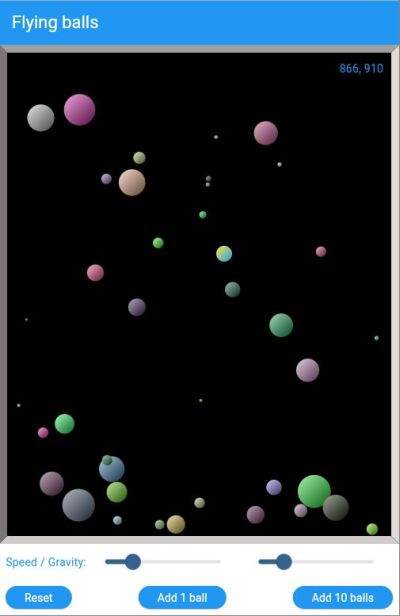
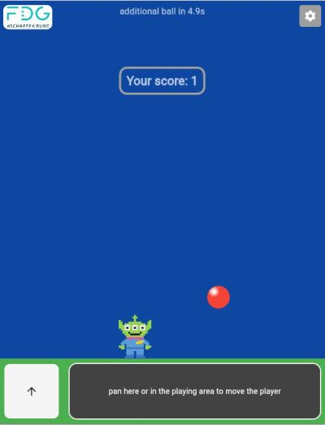

# FDG Flutter training 2024/2025

In October 2024 we started a Flutter training at [Friedrich Dessauer Gymnasium](https://fdg-ab.de/) in Aschaffenburg.

Flutter is a framework from Google for multiplatform development.
It allows to build - based on one code base - apps for Android, IOS, MacOs, Windows, Linux and for the web.

Flutter uses the programming language Dart, so first we learned some basic concepts of Dart like its type system or that methods can have either positional or named parameters or a mix of both.

Then we built our first Flutter app using UI elements like Buttons, Switches, Sliders, ListTiles, Texts and Images and we installed it on our Android devices.

Next we did some mathematics and learned how to calculate _3D transformations_ by multiplying four dimensional matrices. In our [app](https://fdg2425.github.io/web/three_axis_transform_using_git/) we could demonstrate visually, that matrix multiplication is not commutative.

From that point on we used Git to manage the code of our projects and built an app with an _UI like Whatsapp_. It has a hamburger menu, several settings pages, a bottom navigation bar and a scrollable Listview with badges on the items, see [here](https://fdg2425.github.io/web/whatsapp_ui/).

Then we learned to use the Stack widget, gradient colors and Timers in Flutter and built our [flying_balls](https://fdg2425.github.io/web/flying_balls/) application. With panning you can resize the surrounding box of the balls, so we made some experience with gesture detection in Flutter.

Jumping balls are the challenge in the game [Bubble Trouble](https://poki.com/en/g/bubble-trouble). On [Youtube](https://www.youtube.com/watch?v=ZBLOxhiym7k) we had a look how Japanese developer Mitch Koko has implemented a basic version of this game in Flutter and we discussed how to improve Mitch's version with some additional features, see [here](https://fdg2425.github.io/webtest/bubble/navalnorth_branch_gs_ideas/). In case you are interested, you can find more details on our work with Bubble Trouble [here](https://fdg2425.github.io/webtest/bubble/).

Finally we learned how to use external packages in our Flutter apps. As an example we built a Lux Meter where we used [syncfusion_flutter_gauges](https://pub.dev/packages/syncfusion_flutter_gauges) to display the current lux value in a gauge and [fl_chart](https://pub.dev/packages/fl_chart) to show the past values in a line chart.

Thanks to __Alexander__ and __Jonas__ for their strong commitment during the training.
  
***
 
Here some screenshots:
  

[flying_balls](https://fdg2425.github.io/web/flying_balls/)

 

***
 

[Bubble Trouble](https://fdg2425.github.io/webtest/bubble/navalnorth_branch_gs_ideas/)

